> 原文：Moritz Reuss, [Pretrained to Imagine, Fine-Tuned to Act: The Rise of World-Action Models](https://developer.nvidia.com/blog/pretrained-to-imagine-fine-tuned-to-act-the-rise-of-world-action-models/), NVIDIA Technical Blog, June 15, 2026。本文为中文译文，保留原文主要结构、图示和引用编号；文末附有原文 Sources 与 BibTeX。

<details>
<summary>给不熟悉 VLA / WAM 术语的读者准备的速查表</summary>

| 术语 | 含义 |
| --- | --- |
| VLA | Vision-Language-Action model，视觉-语言-动作模型。它通常从预训练的 VLM backbone 出发，再适配成一个能根据视觉观测和语言指令生成动作的机器人策略。大规模 VLM 预训练是这条路线的核心部分，可参考 Pi-0 和 GR00T N1。 |
| WAM | World-Action Model，世界-动作模型。它从预训练的世界模型或视频 backbone 出发，让模型表示或预测场景如何随时间变化，同时输出对应动作。本文统一使用 WAM 这个术语。 |
| VLM | Vision-Language Model，视觉-语言模型。它在图文或视频文本数据上预训练，生成与视觉输入相关联的语言输出，之后通常再被适配到机器人控制。 |
| Video backbone | 被复用为机器人策略核心表征或生成器的预训练视频模型。 |
| World model | 根据语言、机器人动作或 latent action 等动作抽象，预测未来世界状态的模型。预测状态可以是图像、视频、点轨迹、物体状态或 latent features。 |
| Grounding | 把符号，例如语言指令里的词，连接到能满足这些符号的感知对象和运动指令上。language-to-action grounding 指的是把“拿起红色杯子”这样的指令，转成实际完成任务所需的视觉感知与电机命令。grounding gap 就是模型知道语言含义与它能可靠改变物理世界之间的缺口。 |
| Inverse dynamics | 给定当前观测 \(o_t\) 和未来观测 \(o_{t+k}\)，推断最可能产生这个转变的动作或动作序列。 |
| Joint prediction | 给定 \(o_t\) 和语言 \(l_t\)，训练同一个策略 \(\pi(o_t,l_t)\)，同时预测未来观测 \(o_{t+1:t+k}\) 和动作 \(a_{t:t+k}\)。 |
| Action chunk | 一段短时域动作序列 \(a_{t:t+k}\)，也就是 \(k\) 个动作 \(a_t, a_{t+1}, \dots, a_{t+k-1}\)，例如关节命令、末端执行器位移和夹爪状态。模型一次调用就预测整个 chunk。 |
| Mixture-of-Transformers (MoT) | 多个面向不同模态的 transformer 或 expert，例如视频 transformer 和动作 transformer，通过共享 attention 连接，但各自保留独立权重。 |
| Diffusion Transformer (DiT) | diffusion 或 flow-matching 模型中的 transformer backbone，用来通过多步去噪生成图像、视频或动作 token。DiT 常用 adaptive layer normalization 注入时间步条件。 |
| VAE | Variational Autoencoder。本文主要指图像和视频 VAE，它们在生成或策略学习前把高分辨率图像/视频压缩到 latent 表征，以大幅减少 token 数。 |
| Wan | 一族大型预训练视频生成模型，最近常被用作 WAM 的视频 backbone。 |
| Cosmos | NVIDIA 的 physical AI 世界基础模型家族，包括可适配到机器人和策略学习的视频预测模型。 |
| DROID | Distributed Robot Interaction Dataset，大规模真实世界操作数据集，包含 50k+ demonstration，覆盖多样任务，由 Franka Panda 机械臂采集。 |
| RoboArena | 分布式真实世界 benchmark，用于评估通用机器人策略在开放语言条件任务上的表现。 |
| RoboLab | 高保真仿真 benchmark，用于分析 task-generalist robot policy 的视觉、关系和程序性能力。 |
| CALVIN | 面向长时域任务序列的语言条件操作 benchmark，运行在仿真环境中。 |
| LIBERO | 研究机器人操作中的知识迁移、终身学习和泛化能力的 benchmark。 |
| RoboTwin | 面向强 domain randomization 下双臂操作的数据生成器和 benchmark。 |
| FAST / BEAST | 离散动作 tokenization 方法，把连续机器人动作转成 token 序列，让动作学习更接近 VLM 风格训练。 |
| VPP | Video Prediction Policy，一类 WAM 风格方法，使用视频模型的预测视觉表征来条件化机器人动作。 |
| LAPA | Latent Action Pretraining from Videos，不依赖真实机器人动作标签、从视频中学习 action-like latent variable 的方法。 |
| OOD | Out-of-distribution，训练或 demonstration 样本之外的任务、物体、环境或指令。 |
| FLOP / ZFLOP | 浮点运算量。1 ZFLOP = \(10^{21}\) FLOPs。 |
| H100 / GPU-hour | H100 是 NVIDIA 高端训练 GPU；GPU-hour 是一块 GPU 运行一小时的粗略成本单位。 |
| BF16 | Brain floating point 16-bit，训练大型神经网络时常用的低精度数值格式。 |
| I2V | Image-to-video，以初始图像或初始帧为条件的视频生成设置。 |

</details>

**背景：两个基本模块。** 视觉运动策略把当前观测加目标或指令映射到机器人动作。世界模型则从当前世界状态加动作或目标抽象出发，预测未来视觉状态或 latent 状态。WAM 位于两者交叉处：它把预训练视频/世界模型 backbone 当作先验，同时预测未来状态和机器人动作。

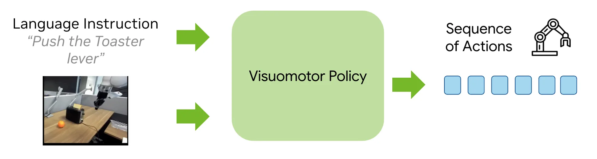

*图：视觉运动策略。*

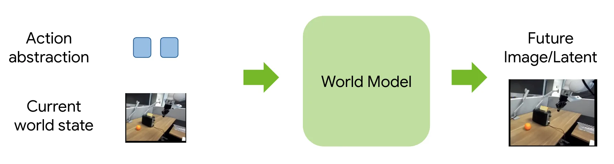

*图：世界模型。*

## 引言

去年，我的 Scholar Inbox 摘要几乎每天都被新的 VLA 论文占据。但过去几个月里，另一个关键词也开始几乎每天出现：WAM，也就是 World-Action Model。2025 年 10 月，我在 State of VLA 那篇文章里还写过，WAM 只是 VLA 研究中的一个小分支，远没有从 VLM 初始化而来的 VLA 流行 <a href="#source-60">[60]</a>。这个局面变得很快，而我当时希望看到更多这类工作的愿望已经成了现实。

那么，究竟发生了什么？为什么是现在？也许只是因为 WAM 是大家都想追的新热点；也可能是 VLA 作者已经把各种 “-VLA” 名字用得差不多了，例如 X-VLA、Ego-VLA 这类名字几乎都被占了，所以现在可以把命名空间回收给 WAM。但更可能的原因是，基于 VLM 的 VLA 开始卡住了。现代 VLA 从大规模视觉语言预训练中获益很多，但仍然会撞上语言到动作的 grounding wall。把语言和像素映射成行为这个问题，仍然必须从机器人数据中学习。WAM 提供了另一个起点：它们使用预训练视频或世界模型 backbone，而这些 backbone 已经在语言条件下建模了场景动力学如何变化。如果这种先验能迁移到行为生成，那么剩下的视频到动作缺口，可能比直接学习语言到动作 grounding 更小。

不过，WAM 背后的想法并不新。UniPi <a href="#source-10">[10]</a> 这样的早期 WAM 在 2023 年就已经提出了本质上类似的方法。那么，为什么这个范式要过几年才进入机器人基础模型的主流？今天它到底走到了哪一步？本文会更仔细地梳理现代 WAM 版图，并回答一个核心问题：

> **核心问题：** WAM 是研究和工业中的真实范式转移，还是一次短暂的 hype cycle？如果这套 recipe 真那么有效，为什么在 UniPi 这样的早期论文之后，还要好几年才变得流行？

我的判断是：WAM 会成为机器人基础模型的第二条主要 recipe，与基于 VLM 的 VLA 并列。开放问题在于，哪一种 WAM 形式会胜出，以及模型架构和训练 pipeline 里的哪些部分真正重要。最终赢家很可能既不是纯 VLA，也不是纯 WAM，而是两者的混合体。

下面是我对现代 WAM 空间的地图：如何分类和理解 WAM、早期模型之后发生了什么变化、以及当前结果与 VLA 相比如何。更宽泛的综述可以参考 NTU 最近的 “World Model for Robot Learning: A Comprehensive Survey” <a href="#source-57">[57]</a>，它从仿真、评估、导航和自动驾驶等方向整理了机器人学习中的世界模型。

## 面向通用策略的两种表示押注


*图 1：通用操作策略的两种主要押注：基于 VLM 的 VLA 与基于视频 backbone 的 WAM。*

当前，研究界和工业界的机器人基础模型大致有两种主要表示路线。很多团队沿着 Pi-0 <a href="#source-2">[2]</a> 建立、后来由 Pi-0.5 <a href="#source-4">[4]</a> 改进的传统 VLA recipe 往前推进，把 VLM backbone 作为策略学习起点。这个 VLM-backbone recipe 已经出现在 NVIDIA GR00T <a href="#source-5">[5]</a>、Xiaomi Robotics <a href="#source-27">[27]</a>、Being-H0.5 <a href="#source-28">[28]</a> 等公开工作中。

最近，另一种范式开始出现：把预训练视频 backbone 用作通向通用操作的另一条路径。公开例子包括 NVIDIA 的 DreamZero <a href="#source-8">[8]</a> 和 Cosmos Policy <a href="#source-13">[13]</a>、Ant Group 的 LingBot-VA <a href="#source-9">[9]</a>、Rhoda AI 的 DVA <a href="#source-40">[40]</a>、Sereact 的 Cortex 2.0 <a href="#source-45">[45]</a>，以及 Mimic Robotics 的 mimic-video <a href="#source-14">[14]</a>。与此同时，很多大学实验室和开放研究团队也在用新想法推进边界，包括 Video Prediction Policy <a href="#source-24">[24]</a>、Unified Video Action Model <a href="#source-39">[39]</a> 和 Fast-WAM <a href="#source-23">[23]</a>。

Backbone 的选择会影响整个训练与评估 pipeline，从训练 recipe、数据混合，到推理优化都会变。考虑到大规模运行这些模型的成本，多数团队很可能必须先押注一个方向，VLA 或 WAM，而不是同时完整追两条线。哪条路会证明自己，或者两条路是否会汇合，现在仍然开放。如果今天下注，你会押哪边？下面我们更深入地看这个决策的两面。

## 为什么是 World-Action Models？一些假设

在深入当前模型之前，我们先回顾为什么 WAM 作为 VLM-based VLA 的替代方案很有吸引力。理解这一点，也需要先把 WAM 放进机器人世界模型的更大图景里。

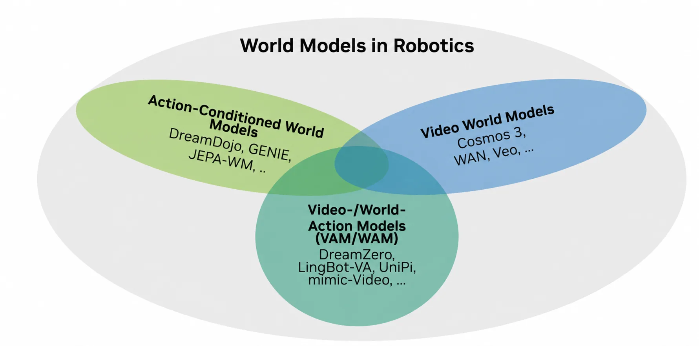

*图 2：机器人中的世界模型。Action-conditioned world model，例如 DreamDojo、Genie、JEPA-WM，从学习到的动作抽象预测未来状态；视频世界模型，例如 Cosmos-3、WAN、Veo、LTX-Video，根据语言和参考帧预测未来视频；DreamZero、LingBot-VA、UniPi 和 mimic-Video 这样的 WAM 位于二者交叉处：它们在会输出动作的机器人策略内部复用视频或世界模型 backbone。*

### Grounding gap

要理解 WAM 为什么有吸引力，先要理解构建在 VLM backbone 上的“经典” VLA 的核心挑战。最早的 VLA 动机，是把 VLM 在互联网规模数据上学到的知识用于机器人。VLM 在海量图文数据上训练，并在很多视觉任务上表现出显著的 zero-shot 能力。VLA recipe 随后把这些预训练表征适配到动作生成。

然而，VLM 预训练和具身操作之间存在巨大的 domain gap。几篇 VLA 论文观察到预训练 VLM 能力下降，或者专门设计方法绕开这个问题，尤其是当动作学习目标与原始 VLM 目标差异很大时。VLM2VLA 直接把这件事称作从 VLM 到 VLA 转换过程中的 catastrophic forgetting <a href="#source-51">[51]</a>。Knowledge Insulation 也报告了类似发现，并把担忧落实到架构上：它把 flow-matching 动作 expert 的梯度与 VLM backbone 隔离，以保留预训练语言/视觉知识，从而改善训练收敛、任务表现和语言跟随能力 <a href="#source-20">[20]</a>。

VLM co-training 和离散动作 tokenizer 等近期方案确实有帮助，但核心挑战仍然存在：如何用有限机器人数据，把语言 grounded 到物理动作中。后文现代 VLA baseline 一节会再讨论这些解决方案。

这自然引出一个问题：如果我们从一个已经表示“语言如何映射到世界中的视觉变化”的 backbone 出发，会怎样？

### WAM 作为策略表征的核心假设

核心想法很简单：不要用 VLM backbone 来启动 imitation learning，而是使用预训练视频 backbone。当前视频模型在大规模视频语料上训练，学习视觉场景如何演化的时空表征。关键是，现在的视频模型常常是 text-conditioned 的：它们被训练成根据精确语言描述生成视频，有时还会附带参考帧，有时则完全从文本出发。

许多视频中包含有意图的行为：手伸向物体、工具移动、物体被操作、场景因为某人或某物的行动而变化。这让视频 backbone 作为通用操作的模型先验很有吸引力。在看到任何机器人动作之前，backbone 已经编码了语言、视觉变化和合理物体交互之间的联系。后面的 Veo 3.1 演示就是一个快速例子。

我会把下面三点看成假设，而不是结论。它们是在论文、同行讨论和我自己对领域的观察中反复出现的主张，有定性直觉、仿真证据和一些早期真实世界信号支持，但目前还没有干净的 matched comparison：

- **预测未来世界变化与生成必要动作相关。** 逆动力学预测通常比纯动作生成更容易 <a href="#source-26">[26]</a>。如果已知想要的结果，推断产生这个结果的动作通常比直接从指令和当前观测预测动作更简单。Pi-0.7 的 visual subgoal 结果也指向同一方向：当策略得到目标未来图像时，动作预测更直接，训练收敛更快 <a href="#source-41">[41]</a>。
- **视频预训练提供了语言与物理变化之间的 grounding。** 视频模型学习把文本描述映射到视觉结果。如果这种能力能迁移到机器人，就可能减少必须从机器人 demonstration 中学习的 grounding 量。
- **视频数据能正则化机器人策略。** 与 web-scale 视频相比，机器人数据集很小。无论是先在视频上预训练，还是在 robot data 旁边 co-train 视频，广义视觉先验都可能减少过拟合；收益取决于数据集、目标和架构。DreamZero <a href="#source-8">[8]</a> 和 Fast-WAM <a href="#source-23">[23]</a> 都表明，在机器人微调期间，当动作学习和视频预测目标共同训练时，WAM 表现最好。

### 一个快速实验：前沿视频模型已经“理解”多少机器人操作？

在加上任何机器人专用动作头之前，现代视频模型已经捕捉到了多少东西？我们用 Google 的前沿视频生成模型 Veo 3.1 做了一个简单实验。给定 DROID 设置中 RoboArena 烤面包机任务的一张原始 rollout 上下文帧，我们提示 Veo 去按下烤面包机拨杆，也就是 reference task，与原始 DROID demonstration 匹配；然后再让它拿起左侧的橙子，也就是超出 demonstration 的 composed extension。

这段视频非常不可能在 Veo 预训练数据中，但我们无法直接验证训练集；因此要把它当成对先验的定性检查，而不是训练集成员关系的受控 probe。实验是一次性尝试，没有 prompt optimization。

使用的 prompt 大意是：给定这张初始帧，生成一段机器人手臂按下烤面包机拨杆的视频。完成后，机器人应该拿起烤面包机左侧的橙子，并在拿起后停止。

上下文帧与真实 rollout：

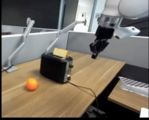

*图 3：DROID 设置中 RoboArena 烤面包机任务的上下文帧。*

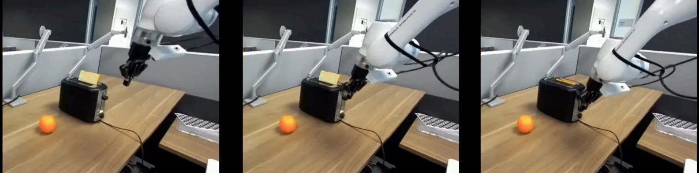

*图 4：真实 rollout：机器人按下烤面包机拨杆。*

Veo 3.1 生成的 rollout（zero-shot，没有机器人微调）：

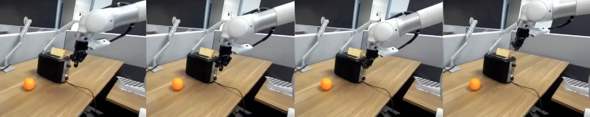

*图 5：Veo 3.1 在 reference task（按下烤面包机拨杆）上的 rollout。*

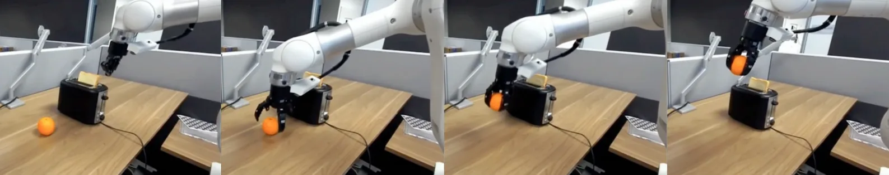

*图 6：Veo 3.1 在 composed extension（按下拨杆后拿起橙子）上的 rollout。*

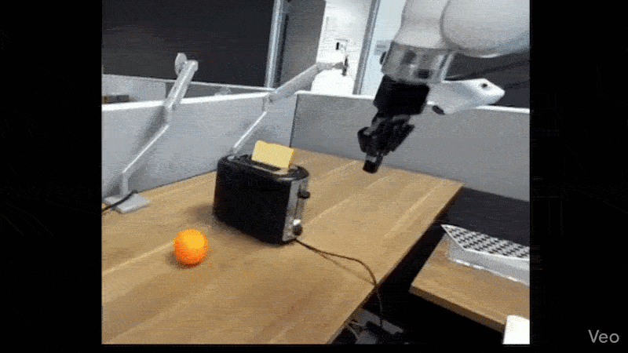

*图 7：完整 composed-extension 序列的动画 rollout：按下拨杆后拿起橙子。*

对于一个没有被显式训练成机器人策略的模型来说，这个生成 rollout 出乎意料地好。生成动作很平滑，背景保持稳定一致，机器人朝两个目标物体的轨迹也合理。甚至顺序也被遵守了：先完成拨杆，再移动到橙子。

局限同样明显：模型并没有完全把烤面包机拨杆按下去，有些时刻甚至像是在做相反动作，也就是往上拉。更明显的是，原始 DROID 设置里的夹爪变形成了四指手。固定基座机械臂几乎在上下文帧之后立刻被重新想象成了另一种自由度更少的机器人。

这些 artifact 符合这样一种解释：模型在使用广泛视觉先验，而不是忠实建模具体硬件。

即便如此，这个结果仍然说明了为什么视频 backbone 对机器人有吸引力：模型已经有了“机器人-物体交互应该长什么样”的有用先验，虽然它还远远不够可靠，不能直接用于控制。WAM 微调要做的，就是把这种 zero-shot imagination 转成可靠控制。

## 理解现代 WAM：核心形式

建立核心动机之后，我们可以聚焦当前的 WAM 研究。与 VLM-based VLA 不同，后者的训练 recipe 已经大致收敛到“VLM co-training + flow transformer 动作生成”，WAM 仍然分裂成几种活跃形式。这也正是这个领域现在有趣的地方：大家还不知道哪一组设计选择会胜出，或者最好的系统是否会合并多个方向。

为了让设计空间更可读，我把 WAM 按三个轴来组织，虽然这三个轴并不完全独立：

1. **范式：** 模型预测什么？预测视频又如何用于生成动作？包括 inverse dynamics、joint prediction、representation-only。
2. **动作如何进入模型：** default action tokens、action-as-image、latent actions/plans。
3. **架构：** 组件如何组合？Mixture-of-Transformers、monolithic、hierarchical。

这些轴并不完全独立，有些 WAM 也很难干净地归入单一类别。我不会把它当成完美 taxonomy；它更像是一张实用地图，让我们读当前论文时不至于迷失在命名里。对每个轴，我都会先用一篇更早的论文介绍想法，再给出现代放大版。

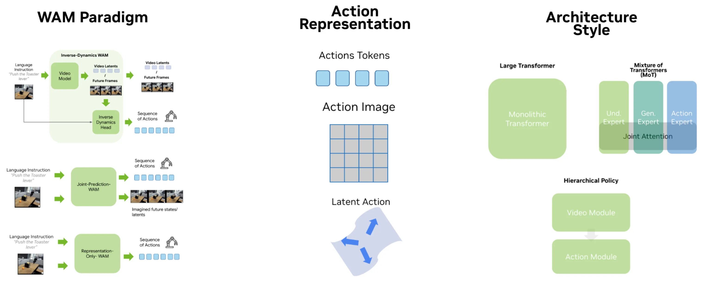

*图 8：WAM 设计空间总览。左：三种范式的差异在于模型预测什么。逆动力学 WAM 生成未来视频，再由此推导动作；联合预测 WAM 同时输出视频和动作；表征型 WAM 只把视频 backbone 当表征使用，并在推理时跳过视频生成。中：三种动作集成选择的差异在于动作如何进入模型。动作可以是独立 token，可以是视频模型天然去噪的 image-shaped target，也可以是压缩 latent actions/plans。右：三种架构风格的差异在于组件如何组合。Monolithic transformer 用一个 stack 处理所有内容；共享 attention 连接的模态专家保留独立权重但交换信息；hierarchical pipeline 先运行视频模块再运行动作模块。*

### 范式：模型预测什么？

第一个轴是策略形式：模型预测什么，以及预测视频如何用于生成动作。在现代 WAM 中，我们看到三种方向，它们在推理边界上不同：inverse dynamics、joint prediction 和 representation-only。

#### 逆动力学：先预测未来，再推断动作

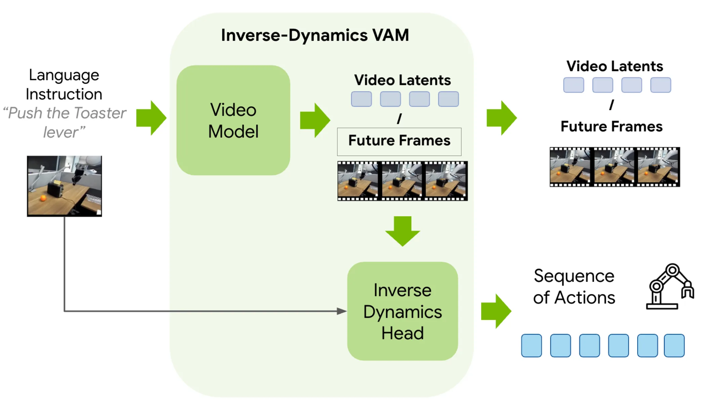

*图 9：逆动力学 WAM。视频模型先根据语言指令和当前观测生成未来帧或 latent，然后 inverse-dynamics head 把预测转变映射成动作序列。具体系统会不同：LingBot-VA 和 DVA 使用完整 RGB future，VPP 和 mimic-video 使用 latent video features，也有系统只用中间特征。*

逆动力学设置是最容易理解的 WAM recipe：先想象未来，再从视频中预测最可能的动作。它把困难的语言 grounding 问题转移到视频阶段：把命令翻译成合理的视觉变化。这个方向的押注是，视频预训练已经学到一部分有用的语言到视觉变化映射，因此动作头不必从机器人 demo 中学习所有东西，可以专注于 inverse-dynamics 问题。

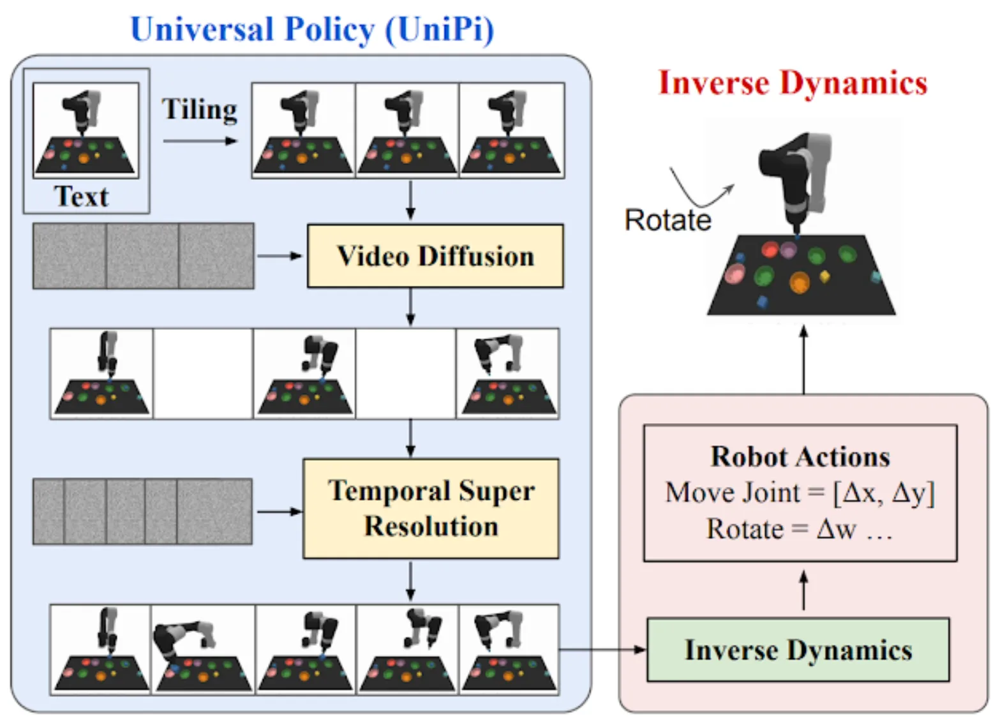

*图 10：UniPi 总览。文本条件视频生成器根据当前帧和语言指令生成未来图像序列，单独的 inverse-dynamics 模块再从连续帧中提取动作。图片来自 Du et al., 2023 <a href="#source-10">[10]</a>。*

UniPi <a href="#source-10">[10]</a> 是这个方向的开创性论文。它可能是第一篇清晰意识到视频 diffusion 对机器人潜力的现代 recipe：把视频当作高层计划，再用逆动力学恢复低层控制。事后看，很多最近的 WAM 工作都像是它的改进版。

UniPi 也解释了为什么 WAM 还需要几年才进入主流。它使用的是 Imagen Video 时代基于 CNN 的视频 diffusion stack，并且视频生成器必须从头预训练。根据原文脚注中的粗略估计，这种预训练大约需要 167 ZFLOPs，远超多数机器人实验室预算。[^unipi-compute] 虽然这套 recipe 早就存在，但当时对普通实验室并不真正可复现。现代 inverse-dynamics WAM 可以从开放的 DiT-based 视频 backbone 出发再微调，从而绕过这一步。

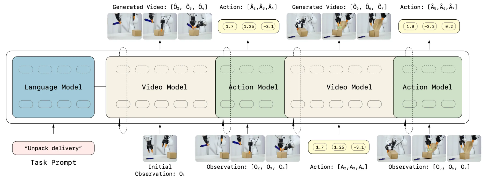

*图 11：LingBot-VA 架构：基于微调 Wan 2.2-5B backbone 的视频 rollout 条件化逆动力学动作预测。图片来自 Li et al., 2026 <a href="#source-9">[9]</a>。*

这个方向的现代版本是 LingBot-VA <a href="#source-9">[9]</a>。它通过 16k 小时 cross-embodiment 预训练，把 Wan 2.2-5B 变成机器人视频-动作模型。它与 UniPi 的关键差异不仅是规模。LingBot-VA 是因果模型，并且在长视觉历史上训练，用于闭环 rollout，而不是开放环视频生成。它还使用 Mixture-of-Transformers (MoT) 架构：视频和动作各有独立 expert 与权重，但在每层通过共享 self-attention 耦合。

| 设计选择 | UniPi <a href="#source-10">[10]</a> | LingBot-VA <a href="#source-9">[9]</a> |
| --- | --- | --- |
| 核心想法 | 生成未来视频计划，再用逆动力学恢复动作。 | 微调视频 backbone，用于闭环机器人 world-action rollout。 |
| Backbone | CNN-based video diffusion，也就是 cascaded U-Net，在 Imagen Video 时代从头训练。 | Wan 2.2-5B latent DiT，开放权重。 |
| Latent video VAE | 无；生成低分辨率 RGB future。 | Wan 2.2-5B，16 x 16 空间压缩、4x 时间压缩 <a href="#source-56">[56]</a>。 |
| Action expert | 单独 CNN action head。 | 通过 joint attention 耦合的 MoT action expert。 |
| Action-video coupling | 单向：先视频，再动作。 | 双向：视频条件化动作；生成动作也条件化视频。 |
| 机器人训练规模 | 小规模，只依赖 demonstration。 | 跨 embodiment 的 16k 小时机器人 world-action 预训练。 |

围绕同一主题还有几个变体。Video Prediction Policy <a href="#source-24">[24]</a>、DiT4DiT <a href="#source-37">[37]</a> 和 mimic-video <a href="#source-14">[14]</a> 不一定需要最终 RGB 视频；它们使用视频模型的中间特征作为动作解码器的 predictive plan。DVA <a href="#source-40">[40]</a> 和 LingBot-VA 则更直接依赖生成或预测的未来 rollout。困难在于，大多数论文同时改变了视频 backbone、使用不同数量的大规模预训练、调整不同超参数，并在不同设置上评估。

#### 联合预测：一起学习视频和动作

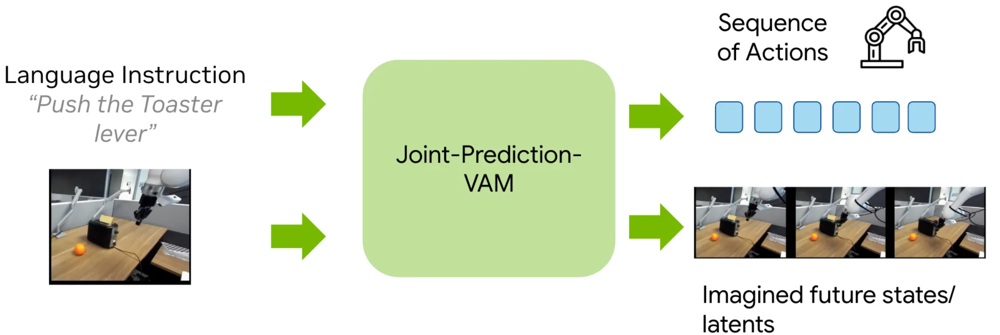

*图 12：联合预测 WAM。单个模型接收语言指令和当前观测，在一次前向中同时输出动作序列和想象的未来状态（帧或 latent），没有单独 inverse-dynamics 模块。*

第二种形式是 joint prediction。模型不先生成未来视频再解码动作，而是同时预测视频和动作。这是 WAM 想法中耦合更强的版本：模型被迫在同一次预测中学习“应该发生什么”和“如何让它发生”。

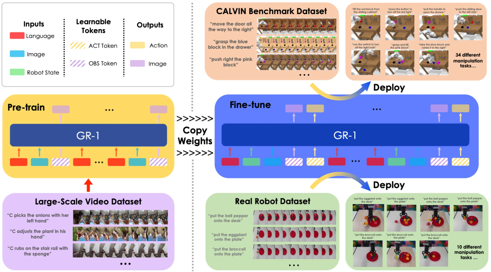

*图 13：GR-1 架构。阶段 1 在视频预测上预训练；阶段 2 在机器人数据上用未来帧和 action chunk 的联合目标微调。图片来自 Wu et al., 2023 <a href="#source-11">[11]</a>。*

GR-1 <a href="#source-11">[11]</a> 是这个方向的早期基础论文。它先在大规模视频上预训练，再在本地机器人数据集上用视频和动作监督微调。它使用 GPT-2 风格的 transformer policy，用 readout tokens 在互联网视频预测上预训练，然后在机器人数据上用联合 video-action 目标微调。R3M <a href="#source-15">[15]</a> 和 Voltron <a href="#source-16">[16]</a> 等早期工作已经显示，视频和语言能帮助机器人表征学习，但 GR-1 做了一个简单而重要的转向：它用视频学习更好的策略表征，而不只是更好的图像级视觉表征。

在当时，CALVIN 结果是有用的仿真证据。在更难的 ABC -> D 划分上，GR-1 表中先前方法的平均序列长度都低于 1.0，而 GR-1 达到 3.06 / 5。这个结果在这里有用，因为它让泛化信号最容易读出来。到 2026 年，这个数字已经过时，但我仍认为它有历史意义：它表明，预测未来视觉状态可以塑造更好的策略表征，而不仅仅是更好的视觉编码器。

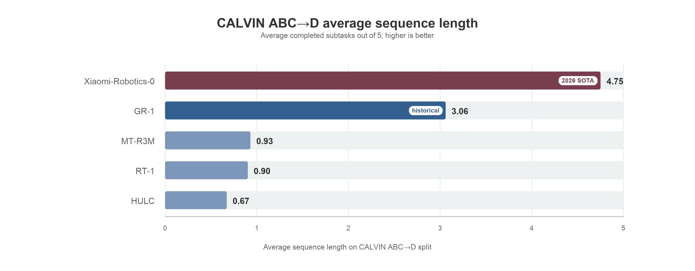

*图 14：CALVIN ABC -> D 结果，以五个子任务中平均完成数总结；GR-1 作为历史结果，Xiaomi-Robotics-0 作为当前 SOTA VLA 参考。数值重绘自 Wu et al., 2023 <a href="#source-11">[11]</a> 和 Xiaomi Robotics, 2026 <a href="#source-27">[27]</a>。*

DreamZero <a href="#source-8">[8]</a> 是这个想法的现代放大版。它不是围绕视频预测 head 训练一个较小的 transformer policy，而是从 Wan 2.1-I2V-14B-480P 出发，把视频 diffusion backbone 变成联合 world-action model。模型在一个 monolithic DiT 内同时 denoise 视频和动作 token。它没有单独 inverse-dynamics 模块：动作是同一个 denoising 过程里的另一种生成模态。

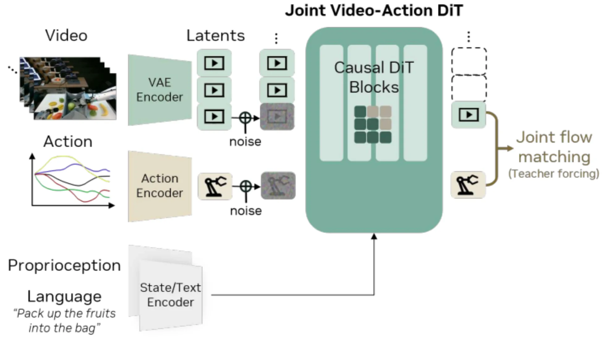

*图 15：DreamZero 架构。一个从 14B Wan 视频 diffusion backbone 初始化的单体 transformer，联合去噪视频 token 和动作 token。图片来自 Ye et al., 2026 <a href="#source-8">[8]</a>。*

DreamZero 报告的 RoboArena 分数是 WAM 的一个重要真实世界信号。大多数论文仍然聚焦 LIBERO 等流行 benchmark 和其他仿真 benchmark，而 RoboArena 是少数公开真实世界开放式评估之一，所以值得停下来看看下面这张 snapshot。

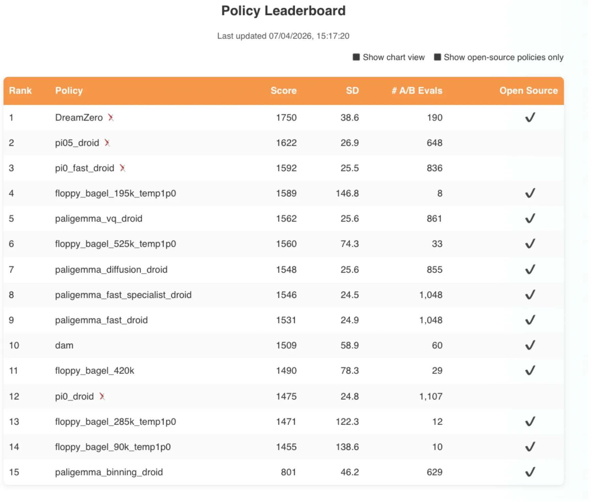

*图 16：2026 年 4 月 RoboArena leaderboard snapshot。Pi-FAST (1592) 高于 Pi-0 (1475)，而 Pi-0.5 (1622) 和 DreamZero (1750) 更进一步。*

在上面的 2026 年 4 月 snapshot 中，DreamZero 达到 1750，而 Pi-0.5 是 1622。这是 WAM 潜力的有意义信号。它不能证明 WAM 是更好的默认选择，但确实是正面信号。特别有趣的是，DreamZero 只在 DROID 上训练，没有额外的大规模 cross-embodiment 机器人训练阶段。

| 设计选择 | GR-1 <a href="#source-11">[11]</a> | DreamZero <a href="#source-8">[8]</a> |
| --- | --- | --- |
| 核心想法 | 把未来帧预测作为辅助目标，同时学习动作。 | 在一个视频 diffusion backbone 中联合去噪未来视频和机器人动作。 |
| Backbone | GPT-2 风格 transformer policy，带 video-prediction readout tokens。 | 适配到机器人控制的 Wan 2.1-I2V-14B-480P video diffusion model。 |
| 规模 | 约 21M policy 参数；预训练视觉和语言编码器分离保留 <a href="#source-55">[55]</a>。 | 14B Wan backbone，端到端 action-tuning。 |
| 生成目标 | 未来视频和动作的 L2 重建。 | 面向 joint future-video 和 action generation 的 flow / denoising。 |
| Latent video VAE | 无；使用预训练 MAE / ViT 视觉特征。 | 继承 Wan latent video VAE。 |
| 语言条件 | CLIP。 | 从 Wan 继承的 T5-family text encoder。 |

GR-1 展示的是策略级 joint video-action prediction，而 DreamZero 把这个想法与现代视频基础模型和 flow-matching 设置结合起来。核心 joint-prediction 想法与 GR-1 相同，但 DreamZero 改掉了周围几乎所有东西，因此这远不是一个干净对比。

GR-2 <a href="#source-12">[12]</a>、Seer <a href="#source-29">[29]</a>、PAD <a href="#source-53">[53]</a>、UWM <a href="#source-54">[54]</a>、UVA <a href="#source-39">[39]</a> 和 DreamVLA <a href="#source-38">[38]</a> 都处在更广义的 joint-prediction 浪潮附近。PAD 是另一个早期尝试，把联合未来图像预测和机器人动作生成放进同一个联合去噪过程。UWM 对视频和动作使用独立噪声，以便在联合 transformer 内支持更灵活的推理模式。

#### 只用表征：推理时跳过视频生成

第三个选项是只把视频 backbone 当表征使用，在推理时完全跳过视频生成。Fast-WAM 是这个想法的好例子。

Fast-WAM <a href="#source-23">[23]</a> 使用与 LingBot-VA 类似的 Wan / MoT 风格设置，并且即便没有 16k 小时大规模机器人预训练，也能在仿真 benchmark 上接近它的表现。此外，测试时跳过视频生成让推理速度快了好几倍。不过，Fast-WAM 是少数支持 representation-only 假设的公开证据之一，而当前仿真证据还不足以真正说服我。但我很乐意被未来工作说服。

现在大多数 WAM 在推理时仍然保留某种视频生成，而且非常慢。Fast-WAM 这类更快 WAM 未来会成为更大的研究方向。

### 动作如何进入模型？

讨论完如何组合视频和动作预测之后，我们转向动作如何在模型内部表示。这个选择很重要，因为预训练 backbone 知道如何 denoise 视觉 token，而不是连续机器人动作，所以这里有真实的模态错配。当前论文里我看到三类变体。

#### 默认动作 token

最简单的默认做法是添加动作 token，连续或离散皆可，再加一个 action head，把动作当成视频旁边的另一种模态。UniPi、GR-1、DreamZero、LingBot-VA、VPP、mimic-video 和 Fast-WAM 都用了某种版本。风险是模态错配：action chunk 与 backbone 预训练时见过的视觉 token 不同，因此模型必须在动作微调期间适配它的表征。

#### Action as image

另一种选择是把动作变成视频模型已经知道的东西。不要添加新动作 token 或单独 action head，而是把动作编码成同一生成接口内的视觉目标，这样预训练视频表征不会被强行打断。

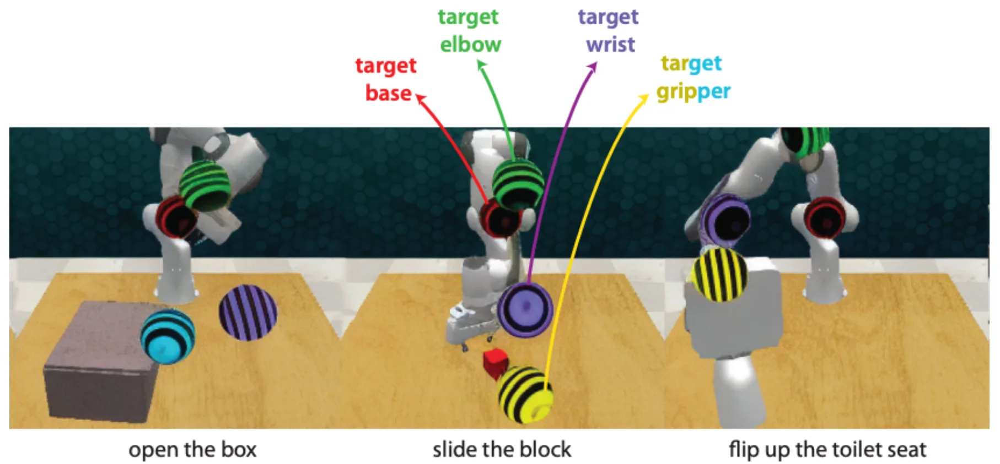

*图 17：GENIMA 把动作转成视觉目标：图像模型在 RGB 空间中预测 joint-action target，下游 controller 再把这些 target 映射回机器人命令。图片来自 Shridhar et al., 2024 <a href="#source-31">[31]</a>。*

这里最接近的早期祖先是 GENIMA <a href="#source-31">[31]</a>。GENIMA 微调 Stable Diffusion，让它在 RGB 图像上画出 joint-action target，然后用 controller 把这些视觉 target 映射成 joint-position actions。有趣的是它的接口选择：动作被表达为生成图像模型能画出来的东西。

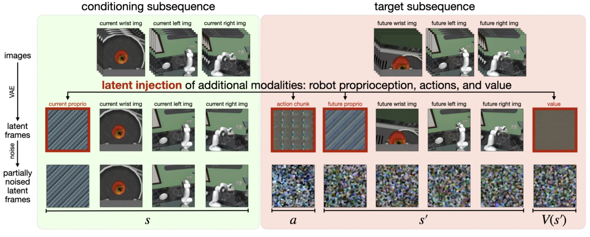

*图 18：Cosmos Policy latent injection：动作、本体感知和值目标被表示成同一视频去噪接口内的合成 latent frames。图片来自 Kim et al., 2026 <a href="#source-13">[13]</a>。*

这个方向的现代版本是 Cosmos Policy <a href="#source-13">[13]</a>，它把动作当成 synthetic latent video frames。它不是添加单独的 action decoder，而是把动作、本体感知和 value target 编码成视频模型自有 denoising 接口里的 fake frames；推理时，通过对空间维度求平均，把预测出的 action image 解码回动作向量。这个设置让预训练视频 backbone 尽量保持在原生视频 denoising 空间内，同时仍然输出机器人动作。

#### Latent actions and plans

另一个选项是把行为压缩成 latent plans 或 latent actions，再用它们条件化策略。这个方向有吸引力，因为完整视频预测很贵，而且大多数像素对控制并不真的必要。Latent plans 和 latent actions 不完全相同，但在这里我把它们放在一起讨论：二者都是从轨迹或视频中学到的紧凑行为抽象。主要差别是粒度和监督方式。Plans 通常覆盖多步窗口，并且常常需要成对机器人数据；Genie / LAPA 风格的 latent actions 可以从无标签视频中学习。

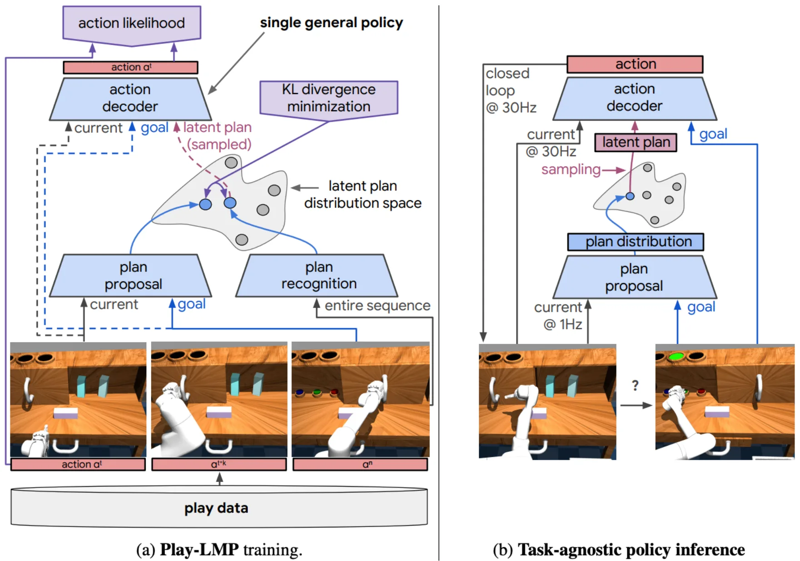

*图 19：Play-LMP 架构。训练时 recognition network 把轨迹窗口压缩成 latent plans；推理时 proposal network 根据当前观测和目标图像预测 latent plan。图片来自 Lynch et al., 2020 <a href="#source-32">[32]</a>。*

Play-LMP <a href="#source-32">[32]</a> 在 2019 年开创了这个想法。值得记住的是，这个基本想法比当前基础模型浪潮更早。Play-LMP 早在今天的大型机器人数据集和预训练模型出现之前，就把子任务压缩进一个小 latent space，作为低层策略的中间条件抽象。具体来说，posterior network 把短轨迹窗口压缩成 latent plan，prior 学习从当前观测和目标图像预测这个 latent plan，低层策略再把采样计划解码成动作。

现代 latent-action 浪潮改变的是规模和数据来源。Genie <a href="#source-19">[19]</a> 表明，可以从无标签互联网视频中学习 latent action token，并用它驱动 action-conditioned world model。Genie 本身不会把这些 latent 解码成真实机器人电机命令，所以它不是机器人策略。但它让这个想法变得更可扩展：无需真实机器人动作标签，就能从视频中学习 action-like abstraction。LAPA <a href="#source-33">[33]</a> 随后把这种 latent-action pretraining 推向 VLA 风格机器人学习。

Being-H0.7 <a href="#source-42">[42]</a> 是原始 Play-LMP 想法的现代 WAM 版本。它保留 prior/posterior latent-plan 逻辑，但在基础模型规模上实现，并有几个重要变化。它不再是小型 hierarchical latent-plan policy，而是使用更大的 Mixture-of-Transformers backbone。类似 Play-LMP，模型有 posterior branch 和 prior branch。Posterior branch 能访问未来观测，用冻结的 V-JEPA2.1 <a href="#source-64">[64]</a> 视觉编码器和 Perceiver resampler 编码，再压缩成 \(K\) 个未来 embedding。Prior branch 使用可学习 latent queries，并从可用上下文中学习匹配那些带未来信息的 latent states。测试时，posterior branch 被移除，因此策略获得的是快速 latent interface，而不是强迫模型重新生成完整视频序列。动作生成部分仍然是 flow-matching action policy。Being-H0.7 在 200,000 小时 egocentric human video 和 15,000 小时 robot demonstrations 上训练。

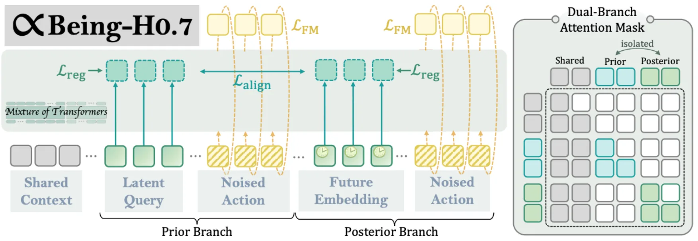

*图 20：Being-H0.7 latent world-action 架构。Posterior branch 把观测到的行为压缩成 latent tokens，而 prior branch 预测这些 token，以实现快速测试时策略推理。图片来自 BeingBeyond Team, 2026 <a href="#source-42">[42]</a>。*

| 设计选择 | Latent Plans / Play-LMP <a href="#source-32">[32]</a> | Being-H0.7 <a href="#source-42">[42]</a> |
| --- | --- | --- |
| 核心想法 | 把短机器人行为窗口压缩成条件化低层策略的 latent plans。 | 从大规模 egocentric video 和机器人 demonstration 中学习 latent world-action model。 |
| 数据来源 | Robot play / demonstration trajectories。 | 200k 小时 egocentric human video + 15k 小时 robot demonstrations。 |
| 架构 | Hierarchical latent-plan policy；LSTM low-level decoder。 | 用于 latent world-action modeling 的大型 MoT transformer。 |
| Latent variable | 轨迹级 latent plan，prior/posterior 训练。 | 相同 prior/posterior 结构，但放大到基础模型规模。 |
| 策略接口 | 预测 prior plan；低层策略根据观测和目标执行。 | 训练两个 branch；测试时只有 prior branch 通过紧凑 latent interface 运行。 |

关键差别不在 latent variable 本身。Play-LMP 已经有核心 prior/posterior latent-plan 想法。Being-H0.7 展示的是，这个接口如何在现代 WAM/VLA hybrid 里被放大。

Latent actions 也开始流行，成为 action-conditioned world model 的抽象。一个近期例子是 DreamDojo <a href="#source-44">[44]</a>，它从大规模 egocentric human video 中学习连续 latent actions，用于 controllable world model。它与逆动力学的重要区别在监督路径上：inverse-dynamics WAM 通常需要成对视频和动作数据，学习视觉转变如何映射到电机命令；latent-action 方法则试图先从视频本身学到行为抽象，再把这个抽象连接到机器人动作。

### 架构：Hierarchical、Monolithic 还是 MoT？

第三个轴是架构：组件在结构上如何组合。这基本独立于前两个轴。逆动力学可以是 hierarchical 或 MoT 风格；联合预测可以是 monolithic 或 expert-based；latent-action 方法也可以放在多种 wrapper 内。

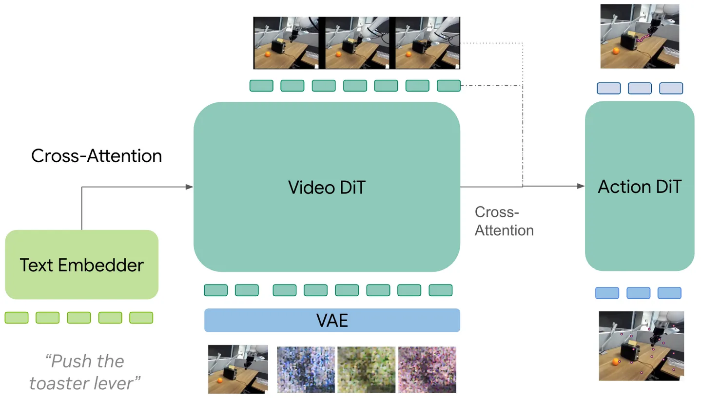

*图 21：Hierarchical：分开的视觉预测阶段和动作生成阶段，单向连接。*

Hierarchical 是最灵活的设计，因为 action head 完全模块化。它可以从简单 CNN regressor（UniPi）到完整 VLA stack（Pi-0.7 的 BAGEL subgoals + 完整 VLA-based action expert），VPP <a href="#source-24">[24]</a> 和 mimic-video <a href="#source-14">[14]</a> 则位于中间，传递中间视频模型特征而不是完整 RGB rollout。缺点是视频和动作阶段之间耦合较弱。信息单向流动，因此当视频和动作应该强烈相互影响时，这种风格不太自然。

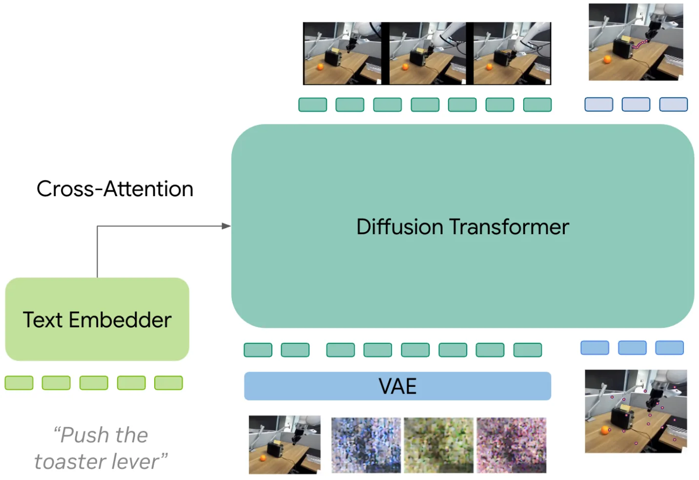

*图 22：Monolithic transformer：单个 transformer 端到端联合 denoise 视频和动作。*

DreamZero <a href="#source-8">[8]</a> 这样的 monolithic transformer 把视频和动作 denoising 放在同一个 stack 里，因此两条流之间耦合很强。它也天然适合 Cosmos Policy <a href="#source-13">[13]</a> 这样的 action-as-image 设置，因为动作和视频已经处在同一个 latent space。风险是双重优化：同一组模型权重必须同时处理密集视觉 token 和稀疏得多的动作 target。

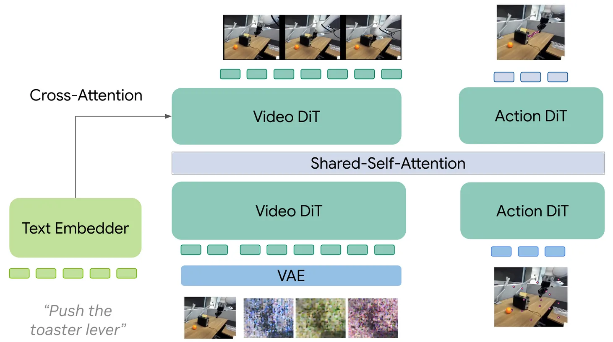

*图 23：Mixture-of-Transformers：通过共享 attention 耦合的模态专用 experts。*

Mixture-of-Transformers (MoT) 是当前默认，包括现代 VLA（Pi-0、Pi-0.5）以及 LingBot-VA <a href="#source-9">[9]</a> 和 Fast-WAM <a href="#source-23">[23]</a> 这样的近期 WAM。模态专用参数让表征保持分离，而共享 attention 仍然允许视频和动作交换信息。我的猜测是，MoT 风格设计也会成为 WAM 主导架构，主要因为它在模块化和耦合之间给出了实用折中。

### 为什么 WAM 现在起飞？

我对“为什么 WAM 现在起飞”的简短回答是：想法并不新，但所需工具，例如预训练视频模型，终于跟上了。早期形式（UniPi 的 inverse dynamics、GR-1 的 joint prediction、Play-LMP 的 latent abstraction）有正确想法，但工具有限：backbone 更小、视频数据更弱、没有开放可用的视频基础模型，而且 per-step action head 与现代 action chunk policy 相比不够好。它们的现代对应物（LingBot-VA、DreamZero、Being-H0.7）使用的是几年前不存在的基础设施和大规模机器人数据集。

第一，视频 backbone 变强了。Wan <a href="#source-21">[21]</a> 和 Cosmos <a href="#source-22">[22]</a> 这样的 DiT-based 模型取代了更早的 CNN-based stack，拥有更好的时间压缩、flow-matching 目标和经过良好清洗的 web-scale 视频数据。第二，这些 backbone 开始开放。研究者现在可以微调强预训练视频模型，而不是自己承担完整预训练成本。第三，动作侧也跟上了：现代系统用 transformer 或 flow-matching head 预测 action chunks，而不是小型 per-step MLP head。这就是为什么 WAM 现在看起来像一个真实 recipe，而不只是“旧想法换新 branding”。

### WAM 对比

下表按不同设计决策总结了前文覆盖的模型：模型预测什么、动作如何进入、使用什么 backbone、采用什么架构。WAM 空间变化很快，所以这里只是选取部分论文。更广泛的世界模型和 WAM 相关机器人学习论文，可以参考 NTU 的 “World Model for Robot Learning” <a href="#source-57">[57]</a> 综述。

| Model | 范式 | 动作集成 | Backbone | 架构 | 年份 |
| --- | --- | --- | --- | --- | --- |
| Play-LMP <a href="#source-32">[32]</a> | 早于 WAM | Latent plan | Transformer + LSTM，从头训练 | Hierarchical | 2019 |
| UniPi <a href="#source-10">[10]</a> | Inverse dynamics | Default action tokens | CNN Video Diffusion，1.7B | Hierarchical | 2023 |
| GR-1 <a href="#source-11">[11]</a> | Joint prediction | Default action tokens | Transformer，从头训练 | Unified Transformer | 2024 |
| GENIMA <a href="#source-31">[31]</a> | Inverse dynamics | Action-as-image | Stable Diffusion / ControlNet | Hierarchical，image generation + controller | 2024 |
| Seer <a href="#source-29">[29]</a> | Inverse dynamics | Default action tokens | Visual/action tokens 上的 transformer | Unified Transformer | 2025 |
| VPP <a href="#source-24">[24]</a> | Inverse dynamics | Default action tokens | Stable Video Diffusion | Hierarchical | 2025 |
| mimic-video <a href="#source-14">[14]</a> | Inverse dynamics | Default action tokens | Video Diff，Cosmos | Hierarchical | 2025 |
| DreamZero <a href="#source-8">[8]</a> | Joint prediction | Default action tokens | Video Diff，Wan 14B | Monolithic DiT | 2026 |
| LingBot-VA <a href="#source-9">[9]</a> | Inverse dynamics | Default action tokens | Video Diff，Wan 2.2-5B | MoT | 2026 |
| Cosmos Policy <a href="#source-13">[13]</a> | Joint prediction | Action-as-image | Video Diff，Cosmos | Monolithic DiT | 2026 |
| Being-H0.7 <a href="#source-42">[42]</a> | Joint prediction，latent | Latent plans / actions | MoT transformer，从头训练，200k + 15k 小时数据 | MoT | 2026 |
| Fast-WAM <a href="#source-23">[23]</a> | Representation-only | Default action tokens | Video Diff，Wan 5.5B | MoT | 2026 |

## 实践考虑

上面我们看到了一些有前景的 WAM 模型和结果。不过，核心问题也不少：

- **训练成本高。** 视频 backbone 处理的 token 比 image-conditioned action policy 多得多，完整视频预训练本身也很贵。
- **推理慢。** 生成或 denoise 未来视频 latent 的策略，比简单 VLA 慢得多。
- **内存和系统复杂度高。** 长视频 token 序列会推高 GPU 内存、通信和数据加载压力。如果没有额外工程工作，想在本地 GPU 上跑 10B+ WAM 模型，祝你好运。

### 视频先验的成本

强视频先验在某些设置中能减少机器人数据需求 <a href="#source-24">[24]</a>, <a href="#source-25">[25]</a>, <a href="#source-42">[42]</a>，并且使用 Wan <a href="#source-21">[21]</a> 这样的现代视频模型时仍能带来强 zero-shot 表现。实践中，这往往是在用计算成本换机器人数据效率。我们可以做一个非常粗略的下界比较。

不同模型的训练成本非常难比较，但可以根据论文和 GitHub repo 中可用细节做一个粗略 lower-bound estimate。因此原文使用简单的 dense-transformer 下界估计：[^compute-accounting]

\[
C \approx 6NT
\]

其中 \(N\) 是可训练 dense 参数量，\(T\) 是处理的 token 数。

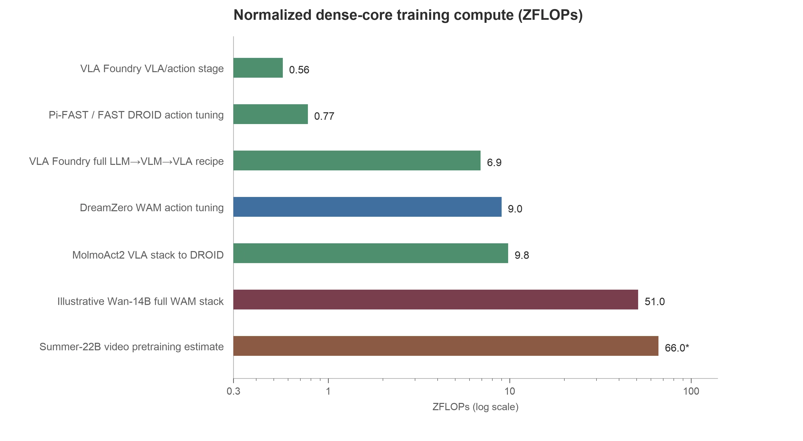

*图 24：以 ZFLOPs 计的 dense-core training compute 下界估计，使用 log scale。请把它看成粗略跨论文比较，而不是精确预算；数值使用各论文/model card 中报告的参数、样本、token 或 GPU-hours，并在原文脚注中给出推导和 caveat。*

VLM-based VLA 在两个训练阶段都更便宜，因为它们的序列更小：它们编码一张到几张图像加文本，然后预测文本或短动作 token 序列。WAM 则训练去预测一段视频 latent 序列，并额外包含动作 token。视频 token 序列通常比 VLA 序列长约 10 倍。这让同一数据集上的训练比默认 VLA 训练更贵。

图 24 给出了不同 VLA/WAM 训练成本估计的概览。DreamZero 风格 action tuning 大约是 9 ZFLOPs，与轻量 VLA 训练行相比很大。MolmoAct2 这样的现代 VLA 报告了从 Molmo2-ER 到 DROID checkpoint 的完整成本，约为 9.8 ZFLOP-equivalent。这假设继承了强 Molmo2-ER backbone，且不计算 Qwen3 或 SigLIP2 预训练成本。Summer-22B 则是理解竞争性视频基础模型规模成本的现代公开视频预训练 token/data 参考：22B 参数模型和论文中约 500B token 的训练规模，给出约 66 ZFLOP 视频预训练估计。如果把这个估计缩小到 DreamZero 的 Wan 规模 14B，可以估计训练视频模型加 WAM stage 合计约 51 ZFLOPs。与高效 VLA Foundry recipe 的 6.9 ZFLOPs 相比，大约有 7.4 倍差距。这些数字展示了规模化 WAM 训练的挑战。

除了总 FLOPs，还有硬件和工程门槛。14B 参数模型配合约 8k-token 的 action-tuning 序列，需要大量 GPU 内存，通常还需要配备高端互联的多节点设置。成功的视频模型训练还依赖稳定的数据过滤、captioning、视频解码、latent 预处理、分布式 I/O 和长序列 DiT 基础设施。

同一论点也有数据质量版本。DreamZero 认为更强的视频生成会转化为更强策略表现 <a href="#source-8">[8]</a>，所以 WAM 不仅吃计算，也吃视频数据质量：过滤、captioning、latent representation 和生成式预训练都会成为策略 recipe 的一部分。VLM-based VLA 没有呈现同样干净的联系。VLM4VLA <a href="#source-49">[49]</a> 发现，相比从头训练，VLM 初始化有帮助，但通用 VLM 能力并不能很好预测下游 VLA 表现。对 WAM 来说，视频生成质量是好策略的要求；对 VLA 来说，空间目标比其他视觉能力更重要。

逐行 caveat 和每个估计背后的推导见原文脚注；这里保留核心对比：

| 对比行 | 计算内容 | 估计 / 报告 accounting | 主要 caveat |
| --- | --- | --- | --- |
| VLA Foundry VLA/action stage | 在预训练 Foundry VLM 上的最终 VLA/action training stage。 | 约 0.56 ZFLOPs，来自约 1.65B 可训练参数、102.4M 样本和约 549 tokens/sample。 | 不包括 LLM 或 VLM 预训练。 |
| Pi-FAST / FAST DROID action tuning | FAST 风格 VLA action-token policy 的代表性 DROID 微调 run。 | 240k-step accounting 约 0.77 ZFLOPs；当前 100k-step OpenPI 配置在同样 token 假设下约 0.32 ZFLOPs。 | 对 step count 和 sequence length 敏感；不是论文报告的计算预算。 |
| VLA Foundry full LLM -> VLM -> VLA recipe | 小型 from-scratch VLA Foundry 路径：语言预训练、VLM 训练、VLA/action 训练。 | 约 6.9 ZFLOPs，主要来自 800B-token LLM stage。 | 这是 1-2B 开放 recipe，不是 frontier-scale VLA。 |
| DreamZero WAM action tuning | 预训练 Wan-14B 视频 backbone 的下游 WAM 适配。 | 100k steps、batch 128、约 8.0-8.4k tokens/sequence 时约 8.6-9.0 ZFLOPs。 | 不包括训练 Wan 的成本，也不包括 frozen encoder、VAE、通信和数据 pipeline overhead。 |
| MolmoAct2 reported VLA stack to DROID | 从 Molmo2-ER 出发的 MolmoAct2-Pretrain、post-training 和 DROID embodiment fine-tune。 | 由报告的 5,760 + 2,304 + 1,152 = 9,216 H100-hours 得到约 9.8 ZFLOP-equivalent。 | 不包括 Molmo2-4B、Molmo2-ER specialization、OpenFAST tokenizer training 和上游 Qwen3/SigLIP2 预训练。 |
| Illustrative Wan-14B full WAM stack | Wan-scale 视频预训练 proxy 加 DreamZero 风格 action tuning。 | 约 51 ZFLOPs = 14B 参数 Wan 风格视频预训练 proxy over 500B tokens + DreamZero 风格 tuning。 | 这不是 Summer-22B + DreamZero；它只是用 Summer 的 token budget 作为 Wan-scale 视频预训练 proxy。 |
| Summer-22B video pretraining estimate | 从头训练视频模型时报告的约 500B-token 视频预训练数据规模。 | 22B 参数模型 over 500B video tokens 得到约 66 ZFLOPs。 | 这是透明视频预训练估计，不是论文报告的 FLOP 总量。 |

### 推理速度

总体上，VLM-based VLA 并不总是快，但默认 WAM 如果在测试时生成视频，可能更慢。精确数字取决于硬件、实现、diffusion steps 和 action chunk length，但 Fast-WAM <a href="#source-23">[23]</a> 中的代表值提供了有用参考：两种常见 WAM 推理模式，也就是 joint prediction 和带完整视频生成的 inverse dynamics，每个 action chunk 需要 590ms 到 800ms，而 Pi-0.5 约为 190ms。

这意味着推理时间慢 3-4 倍，对实时控制影响很大。可以加速，例如 DreamZero <a href="#source-8">[8]</a> 和 Fast-WAM 的“完全跳过视频生成”思路都展示了可能路径，但如果没有大型 GPU，在本地运行这些模型仍然很困难。

## 为什么现代 VLA baseline 仍然重要？

现代 VLM-based VLA 进步很快，最强 baseline 现在结合了四个想法：离散动作 tokenization、保留 VLM 能力的 co-training、隔离 action head，以及更广泛的数据混合。任何声称视频 backbone 是更好默认选择的主张，都必须击败当前 SOTA recipe。

VLA 架构已经收敛到一个默认设置：Mixture-of-Transformers recipe。它最初由 Transfusion <a href="#source-30">[30]</a> 在视觉中引入，并由 Pi-0 <a href="#source-2">[2]</a> 在机器人中推广。真正变化的主要是训练 recipe。早期 flow-based action head 会从离散 next-token VLM 预训练突然切换到连续动作 denoising，造成强烈扰动。更新的 recipe 试图减少这种扰动。

首先，很多现代 VLA 使用 FAST <a href="#source-3">[3]</a> 或 BEAST <a href="#source-34">[34]</a> 这样的离散 tokenizer，把动作表示为 VLM 可以学习的一种新语言。这背后的动机是优化张力：VLM 为离散 next-token prediction 和 cross-entropy loss 预训练，而机器人动作存在于连续空间，通常用 flow matching 建模。直接用 flow-matching 目标微调 VLM，会导致预训练语言和视觉能力 catastrophic forgetting <a href="#source-51">[51]</a>。使用离散动作 tokenization co-training，并常常结合 flow-matching head 的梯度隔离，可以绕开这个问题。VLM 能更接近自己偏好的离散空间，同时学习 embodied control 所需的有用表征；flow-matching head 则基于这些特征做自己的动作预测。测试时，带单独 action head 的系统可以丢掉慢的 autoregressive action-token prediction 路径，让 action head 完成工作。

为了直观看到 catastrophic forgetting 问题的影响，我们再看 RoboArena <a href="#source-1">[1]</a> snapshot。Pi-FAST 使用与 Pi-0-DROID 相同的 backbone，但没有 flow component，而是用离散 FAST token 生成动作。二者都在 DROID 上微调。Pi-FAST 分数达到 1592，而 Pi-0 只有 1475，差距相当大。这支持了一个观点：离散动作 recipe 相比原始 Pi-0 flow-based 设置，能保留更多有用预训练能力。

其次，Pi-0.5 风格系统会在 VLM 数据和机器人数据上 co-train，并常常在 VLM 与 flow/action 组件之间隔离梯度，以获得更快、更稳定的收敛 <a href="#source-4">[4]</a>, <a href="#source-20">[20]</a>。这样，VLM 可以继续练习语言和视觉理解，而动作侧专门适配操作。类似模式也出现在 Pi-0.5、Xiaomi-robotics-0 <a href="#source-27">[27]</a> 和 Being-H0.5 <a href="#source-28">[28]</a> 等近期 VLA 中。Pi-0.5 在 RoboArena 上明显超过 Pi-FAST 和 Pi-0（1622 vs 1592 vs 1475）。这些结果与训练设计决策对策略表现的重要性一致。

即便 recipe 有这些改进，VLA 仍然会撞上 grounding wall。语言是一种对行为目标表达不充分的方式。杂乱场景中的文本指令，很少能完全指定相关物体实例或期望物理状态。因此策略可能过拟合到背景物体等伪相关或数据集 bias。Pi-0.7 报告的 language-only prompting 与 goal-image conditioning 差距支持这一点：visual subgoals 改善语言跟随，并让训练收敛更快 <a href="#source-41">[41]</a>。DreamZero 在同一 RoboArena snapshot 中的 1750 elo-score，也支持视频/图像目标先验能帮助解决这类问题。

所以，目前 WAM 和 VLA 没有真正赢家，甚至未来是否会有赢家也值得怀疑。Zhang et al. <a href="#source-25">[25]</a> 这样的早期比较，在 matched perturbations 下，在 LIBERO-Plus 和 RoboTwin 2.0-Plus 上评估 LingBot-VA、Cosmos Policy 和 Pi-0.5。结果显示，WAM 即使没有 VLA baseline 使用的更广泛训练数据混合，也能达到强鲁棒性。不过，这个比较局限于仿真环境，没有覆盖真实世界泛化。

## 两条表示路线其实会合成一条吗？

开放问题是，从长期看这两条路是否还会保持区别。一些近期 VLA 已经使用 world-model-style 组件来提升目标跟随，例如 Pi-0.7；许多近期 WAM 也借用了 VLA 的 MoT recipe 来做 action expert。机器人基础模型的未来看起来会是二者混合。


*图 25：可能的汇合：VLA-style、WAM-style，以及结合两者的第三条通用路径。*

Motus <a href="#source-17">[17]</a> 和 BagelVLA <a href="#source-18">[18]</a> 等近期工作已经显示了这种方向的早期迹象。与其决定语言或视频哪个应该成为机器人的主要表征，不如训练一个全都能做的模型。图 26 是一个简化版本：understanding/VLM 组件、video-generation 组件和 action expert。每个 tower 有专门权重，同时通过共享 self-attention 交换信息，常常还采用非对称模式，让每个 tower 向其他 tower 暴露不同信息。Dense transformer 或 MoE-style routing 都可以实现类似高层想法。

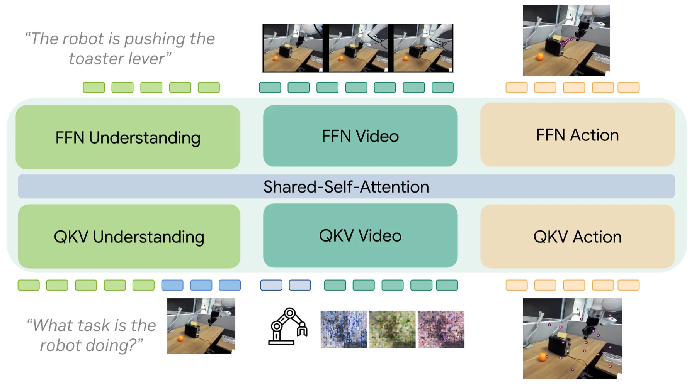

*图 26：Motus-style hybrid setup：视频建模和动作生成由独立 transformer 处理，同时共享 attention 和文本条件，指向统一 VLA+WAM policy recipe。*

这种 hybrid 的 hierarchical 版本也出现在 Physical Intelligence 最近的 Pi-0.7 <a href="#source-41">[41]</a> 中。Pi-0.7 是一个 steerable VLA，它的 action expert 在测试时由基于 BAGEL 的 world model <a href="#source-50">[50]</a> 生成的 visual subgoals 条件化。高层策略输出子任务指令，world model 把这些指令转成 subgoal images，action expert 再基于当前观测和 subgoal 执行。

报告的 ablation 支持 language-following 论点：添加 world-model subgoals 能提升复杂 referential task 上的指令跟随能力，而且据称对一些打破 dataset bias 的任务是必要的，no-subgoal 变体会失败。作者还报告说，subgoal images 显著加快训练，因为动作预测更接近当前帧与目标未来帧之间的 inverse-dynamics 问题。在证据阶梯上，这是一个真实世界信号：visual subgoals 可以在 VLA-style stack 内弥合一部分 language-grounding gap。但这不需要更强主张，即每个强 VLA 都必须有完整视频生成 head。

Sereact 的 Cortex 2.0 <a href="#source-45">[45]</a> 是另一个指向 hybrid 方向的 startup 例子。Cortex 2.0 添加了一个 world model，在视觉 latent space 中生成候选未来轨迹，并根据预期进展、风险和效率打分，再用最高分 rollout 条件化执行。这是工业信号：WAM-style foresight 正在成为部署式操作系统中的 planning layer。

Being-H0.7 <a href="#source-42">[42]</a> 是 foundation-model hybrid 的最佳例子：它是一个基于预训练 VLA Being-H0.5 的 latent-plan-style WAM/VLA，使用 InternVL3.5 作为 understanding expert、Qwen3 作为 action expert，并使用 V-JEPA2.1 <a href="#source-64">[64]</a> visual encoders。它把 VLA-style 预训练组件、V-JEPA2.1 <a href="#source-64">[64]</a> future-observation embeddings、Play-LMP-style prior/posterior latent interface，以及 flow-matching action policy 组合到一起。

计算成本是目前“一个模型全都做”系统很少的主要原因。训练强 VLM 已经很贵；再叠加大规模视频建模，成本进一步上升。因此，在短期内区分 VLA-style 和 WAM-style 训练仍然有用，一方面是因为计算限制，另一方面是因为我们仍不知道哪些 ingredient 对机器人最重要。你认为这两条路会真正合并，还是其中一条最终胜出？

### 第四条路：Robotics-first foundation models

第四种可能是 robotics-first foundation model (RFFM)。基本上，这会是一种围绕机器人挑战设计的大型 transformer 架构：embodiment、action、contact-rich interaction 和 embodied memory。这个路径的干净版本，不会简单地从 web VLM 或视频生成器出发，再事后接上动作；它会从预训练一开始就把交互和动作放在中心位置。

我知道的最干净例子是 Generalist AI 的 GEN-1，它提出了一个在 500k 小时 UMI-style wearable data 上预训练的大型机器人行为模型。这个方向的核心问题是访问权限：除了资金雄厚的 startup 和大公司，几乎没人能获得这种规模的人类或机器人数据。所以在获得更多大规模开放机器人数据之前，这条研究路径对社区来说目前是受阻的。

另一个正交方向也值得指出：V-JEPA 2 <a href="#source-43">[43]</a> 这样的 latent world model。它们直接在预训练 latent space 内从视频中学习 latent dynamics。这些模型承诺比 diffusion-based 视频生成更便宜的 rollout、更快推理和更干净的规划信号。这个方向的早期 WAM，例如 VLA-JEPA <a href="#source-63">[63]</a> 或 Being-H0.7 <a href="#source-42">[42]</a>，已经报告了有前景的表现。

## 结语

WAM 会成为机器人基础模型的核心研究分支。VLA 已经收敛到一套大致共享的 recipe：VLM backbone、带 flow matching 的梯度隔离 action expert、以及在广泛 web 和 robotics 数据混合上的 co-training。WAM 则仍处于探索阶段。论文在视频 backbone、策略形式、训练 recipe 和评估设置上差异很大。对一个年轻领域来说，这种研究多样性是健康的，也有许多新想法正在发表。

不过，还没有人真正知道什么最好。

这篇文章的结论可以概括为：

- **从指令到运动的缺口仍然存在。** 即使现代 VLA 有离散动作 tokenization、保留 VLM 能力的 co-training 和广泛数据混合，也没有完全关闭这个缺口。WAM 承诺从视频侧攻击这个问题，但当前结果还没有显示它们已经解决了问题。
- **机器人 benchmark 仍然是核心问题。** 我必须重复上一篇文章中的发现：现代 VLA 和 WAM benchmarking 尚未解决。我们需要更多 RoboLab <a href="#source-62">[62]</a> 或 MolmoSpaces <a href="#source-61">[61]</a> 这样的 benchmark，让 benchmaxxing 更难，并要求真正的策略泛化才能拿到好分数。
- **下一代机器人基础模型很可能是 WAM+VLA hybrid。** Pi-0.7 的 BAGEL subgoals、Cortex 2.0 的 planning-by-foresight、Being-H0.7 的 latent prior/posterior bridge，以及 Motus / BagelVLA 风格 hybrid，都已经在合并 VLA 和 WAM 思想。从头训练的第一批机器人基础模型也是一个有可能的押注，尤其是当我们能获得更多更好的开放机器人数据后。

这就是我目前对 WAM 所处位置的判断。如果你有不同看法，或者有很强的理由支持其中一条路径，欢迎联系我；我会很乐意听到。

[^unipi-compute]: **UniPi / CNN diffusion 计算细节。** 估计 UniPi 所用 3D U-Net，也就是继承 Imagen Video base architecture 的模型 FLOPs，需要与 Transformer 的 Chinchilla 公式不同的方法。卷积神经网络会让 kernel 在空间和时间维度滑动并共享权重，因此计算量会随分辨率和帧数剧烈变化。以下数字只是粗略数量级估计。

    - **Forward pass：** base model 生成 16 帧、分辨率 24 x 40，总计 15,360 像素。考虑 U-Net 架构中的空间下采样后，所有 1.7B 参数实际处理的“有效像素”约为每个视频 4,000。Forward FLOPs 约 \(2 \times 1.7B \times 4,000 \approx 13.6\) TFLOPs / video。
    - **Total training FLOPs：** 训练运行 2,000,000 steps，global batch size 2,048。考虑前向和反向的标准乘数 3：

    \[
    C = 3 \times 13.6\text{ TFLOPs} \times 2048 \times 2,000,000 \approx 1.67 \times 10^{23}\text{ FLOPs}
    \]

    换算直觉上，这是约 167 ZFLOPs。在 936 H100-hours / ZFLOP 的直觉下，约为 156,000 H100-hours；如果使用更低的实测有效吞吐假设，例如约 224 TFLOPS/GPU，则约为 207,000 H100-hours。虽然 UniPi 的 1.7B 参数量远小于 DreamZero 的 14B，但必须从头预训练视频基础模型，可能让早期 WAM-style recipe 对多数机器人实验室来说过于昂贵。近期动量部分来自开放预训练视频模型，例如 Wan，它让研究者可以跳过这个 \(10^{23}\) FLOP 级预训练阶段。

[^compute-accounting]: **Normalized compute accounting.** 原文柱状图使用 dense-transformer lower-bound：

    \[
    C_\text{train} \approx 6 \times N_\text{train} \times T
    \]

    其中 \(N_\text{train}\) 是可训练 dense 参数量，\(T\) 是处理的 token 数。数值以 ZFLOPs 报告，\(1\text{ ZFLOP}=10^{21}\) FLOPs。H100-hour 直觉使用非稀疏 dense BF16-equivalent H100 峰值吞吐量的约 30% 利用率，得到 \(1\text{ ZFLOP} \approx 936\) H100-hours。

    这个估计不包括 preprocessing、dataloading、optimizer overhead、frozen encoder passes、VAE encoding/decoding、超过简单 \(6NT\) 近似的 attention 项、通信开销以及硬件特定效率。它的目的只是做数量级归一化，不是精确系统审计。

    - **VLA Foundry LLM pretraining：** Foundry-LLM checkpoint 的 model card 报告了一个 1.2B non-embedding 参数语言模型，在 800B DCLM-Baseline-1.0 token 上训练。用估计中的 1.23B 参数数，\(C \approx 6 \times 1.23B \times 800B = 5.9\) ZFLOPs，约 5.5k H100-hours。
    - **VLA Foundry VLM stage：** Foundry-VLM-1.3B-200M model card 报告 1.3B non-embedding 参数 VLM，在 200M image-caption pairs 上训练，并从 Foundry-LLM-1.2B-800B 初始化 <a href="#source-46">[46]</a>。按每个样本一个 256-token multimodal sequence 计算，得到 \(T \approx 200M \times 256 = 51.2B\)，\(C \approx 6 \times 1.32B \times 51.2B = 0.41\) ZFLOPs，约 0.4k H100-hours。
    - **VLA Foundry VLA/action stage：** Foundry-VLA-1.7B-full model card 报告一个 1.7B non-embedding 参数 VLA，在 102M 仿真和真实双臂操作样本上训练。使用平均 549-token 序列估计，\(T \approx 102.4M \times 549 = 56.2B\)，\(C \approx 6 \times 1.65B \times 56.2B = 0.56\) ZFLOPs，约 0.5k H100-hours。加上 LLM、VLM、VLA stage，总计约 6.9 ZFLOPs。
    - **Pi-FAST / FAST DROID action tuning：** 使用早期 240k-step DROID accounting，global batch 256，约 700-token 序列：\(T \approx 240k \times 256 \times 700 = 43B\)，因此 \(C \approx 6 \times 3B \times 43B = 0.77\) ZFLOPs，约 0.7k H100-hours。当前 100k-step OpenPI 配置在同样假设下约 0.32 ZFLOPs。
    - **MolmoAct2 reported VLA stack to DROID：** MolmoAct2 <a href="#source-58">[58]</a> 报告 MolmoAct2-Pretrain 为 5,760 H100-hours，post-training 为 2,300 H100-hours，DROID fine-tune 为 1,150 H100-hours。合计 9,210 H100-hours，并用 \(1\text{ ZFLOP}\approx936\) H100-hours 转成约 9.8 ZFLOP-equivalent。
    - **DreamZero WAM action tuning：** DreamZero <a href="#source-8">[8]</a> 报告了 14B Wan2.1-I2V-14B-480P backbone、100K training steps、global batch size 128。根据 frame/action 设置和 Wan-style latent-token 近似，序列长度约 8.0k-8.4k tokens。上界估计使用 8,361 tokens，得到 \(T \approx 100k \times 128 \times 8,361 = 107B\)，\(C \approx 6 \times 14B \times 107B = 9.0\) ZFLOPs，约 8.4k H100-hours；略短的 8.0k-token accounting 给出约 8.6 ZFLOPs。
    - **Summer-22B video pretraining：** Summer-22B <a href="#source-47">[47]</a> 报告 22B 参数视频 diffusion model 从头训练在约 50M clips 上，描述为约 500B video tokens。用 \(C \approx 6 \times 22B \times 500B\) 得到 66 ZFLOPs，约 62k H100-hours。
    - **Illustrative full WAM stack：** 因为 Wan-14B 预训练计算未报告，原文加入一个透明 proxy，把 Summer-22B-style 视频预训练加 DreamZero-style WAM action tuning：66 + 9.0 = 75.0 ZFLOPs，约 70k H100-hours before extra overhead。这不是报告的 DreamZero total，也不应归因于 Wan。
    - **Wan-14B pretraining：** Wan <a href="#source-21">[21]</a> 报告一个 14B video model 在大型 curated image/video corpus 上训练，但没有披露 token count 或完整训练计算预算。因为 DreamZero 从 Wan2.1 出发，DreamZero action-tuning 数字应理解为下游 WAM adaptation 成本，而不是生成底层视频 backbone 的完整成本。

    这些都是 dense-core 下界估计，且有几行是重新计算的估计，而不是论文报告的计算预算。它们可以帮助比较不同训练 recipe 的粗略位置，但不应被读成精确 wall-clock cost、cloud cost 或端到端能耗。

## 致谢与引用

原作者感谢 Alexander Schwarz、Ankit Goyal、Elie Aljalbout、Fabio Ramos、Seonghyeon Ye、Shenyuan Gao、Xuning Yang、Yashraj Narang 和 Yixuan Wang 的反馈与讨论。

本文保留原文引用编号；以下 Sources 与 BibTeX 来自 [NVIDIA 原文](https://developer.nvidia.com/blog/pretrained-to-imagine-fine-tuned-to-act-the-rise-of-world-action-models/)。

## Sources

1. <span id="source-1"></span>Atreya, Pranav, et al. "RoboArena: Distributed Real-World Evaluation of Generalist Robot Policies." CoRL 2025. [paper](https://arxiv.org/abs/2506.18123)
2. <span id="source-2"></span>Black, Kevin, et al. "Pi-0: A Vision-Language-Action Flow Model for General Robot Control." arXiv 2024. [paper](https://arxiv.org/abs/2410.24164)
3. <span id="source-3"></span>Pertsch, Karl, et al. "FAST: Efficient Action Tokenization for Vision-Language-Action Models." arXiv 2025. [paper](https://arxiv.org/abs/2501.09747)
4. <span id="source-4"></span>Physical Intelligence, et al. "Pi-0.5: A Vision-Language-Action Model with Open-World Generalization." arXiv 2025. [paper](https://arxiv.org/abs/2504.16054)
5. <span id="source-5"></span>Bjorck, Johan, et al. "GR00T N1: An Open Foundation Model for Generalist Humanoid Robots." arXiv 2025. [paper](https://arxiv.org/abs/2503.14734)
6. <span id="source-6"></span>Liu, Bo, et al. "LIBERO: Benchmarking Knowledge Transfer for Lifelong Robot Learning." NeurIPS 2023. [paper](https://arxiv.org/abs/2306.03310)
7. <span id="source-7"></span>Mees, Oier, et al. "CALVIN: A Benchmark for Language-Conditioned Policy Learning for Long-Horizon Robot Manipulation Tasks." RA-L 2022. [paper](https://arxiv.org/abs/2112.03227)
8. <span id="source-8"></span>Ye, Seonghyeon, et al. "World Action Models Are Zero-shot Policies." arXiv 2026. [paper](https://arxiv.org/abs/2602.15922)
9. <span id="source-9"></span>Li, Lin, et al. "Causal World Modeling for Robot Control." arXiv 2026. [paper](https://arxiv.org/abs/2601.21998)
10. <span id="source-10"></span>Du, Yilun, et al. "Learning Universal Policies via Text-Guided Video Generation." NeurIPS 2023. [paper](https://proceedings.neurips.cc/paper_files/paper/2023/file/1d5b9233ad716a43be5c0d3023cb82d0-Paper-Conference.pdf)
11. <span id="source-11"></span>Wu, Hongtao, et al. "Unleashing Large-Scale Video Generative Pre-training for Visual Robot Manipulation." ICLR 2024. [paper](https://arxiv.org/abs/2312.13139)
12. <span id="source-12"></span>Cheang, Chi-Lam, et al. "GR-2: A Generative Video-Language-Action Model with Web-Scale Knowledge for Robot Manipulation." arXiv 2024. [paper](https://arxiv.org/abs/2410.06158)
13. <span id="source-13"></span>Kim, Moo Jin, et al. "Cosmos Policy: Fine-Tuning Video Models for Visuomotor Control and Planning." arXiv 2026. [paper](https://arxiv.org/abs/2601.16163)
14. <span id="source-14"></span>Pai, Jonas, et al. "mimic-video: Video-Action Models for Generalizable Robot Control Beyond VLAs." arXiv 2025. [paper](https://arxiv.org/abs/2512.15692)
15. <span id="source-15"></span>Nair, Suraj, et al. "R3M: A Universal Visual Representation for Robot Manipulation." arXiv 2022. [paper](https://arxiv.org/abs/2203.12601)
16. <span id="source-16"></span>Karamcheti, Siddharth, et al. "Language-Driven Representation Learning for Robotics." arXiv 2023. [paper](https://arxiv.org/abs/2302.12766)
17. <span id="source-17"></span>Bi, Hongzhe, et al. "Motus: A Unified Latent Action World Model." arXiv 2025. [paper](https://arxiv.org/abs/2512.13030)
18. <span id="source-18"></span>Hu, Yucheng, et al. "BagelVLA: Enhancing Long-Horizon Manipulation via Interleaved Vision-Language-Action Generation." arXiv 2026. [paper](https://arxiv.org/abs/2602.09849)
19. <span id="source-19"></span>Bruce, Jake, et al. "Genie: Generative Interactive Environments." ICML 2024. [paper](https://arxiv.org/abs/2402.15391)
20. <span id="source-20"></span>Driess, Danny, et al. "Knowledge Insulating Vision-Language-Action Models: Train Fast, Run Fast, Generalize Better." NeurIPS 2025. [paper](https://arxiv.org/abs/2505.23705)
21. <span id="source-21"></span>Wan Team, et al. "Wan: Open and Advanced Large-Scale Video Generative Models." arXiv 2025. [paper](https://arxiv.org/abs/2503.20314)
22. <span id="source-22"></span>Agarwal, Niket, et al. "Cosmos World Foundation Model Platform for Physical AI." arXiv 2025. [paper](https://arxiv.org/abs/2501.03575)
23. <span id="source-23"></span>Yuan, Tianyuan, et al. "Fast-WAM: Do World Action Models Need Test-time Future Imagination?" arXiv 2026. [paper](https://arxiv.org/abs/2603.16666)
24. <span id="source-24"></span>Hu, Yucheng, et al. "Video Prediction Policy: A Generalist Robot Policy with Predictive Visual Representations." ICML 2025. [paper](https://arxiv.org/abs/2412.14803)
25. <span id="source-25"></span>Zhang, Zhanguang, et al. "Do World Action Models Generalize Better than VLAs? A Robustness Study." arXiv 2026. [paper](https://arxiv.org/abs/2603.22078)
26. <span id="source-26"></span>Schäfer, Lukas, et al. "When does predictive inverse dynamics outperform behavior cloning?." arXiv preprint arXiv:2601.21718 (2026). [paper](https://arxiv.org/abs/2601.21718)
27. <span id="source-27"></span>Cai, Rui, et al. "Xiaomi-robotics-0: An open-sourced vision-language-action model with real-time execution." arXiv 2026. [paper](https://arxiv.org/abs/2602.12684)
28. <span id="source-28"></span>Luo, Hao, et al. "Being-H0.5: Scaling Human-Centric Robot Learning for Cross-Embodiment Generalization." arXiv 2026. [paper](https://arxiv.org/abs/2601.12993)
29. <span id="source-29"></span>Tian, Yang, et al. "Predictive Inverse Dynamics Models are Scalable Learners for Robotic Manipulation." ICLR 2025. [paper](https://arxiv.org/abs/2412.15109)
30. <span id="source-30"></span>Zhou, Chunting, et al. "Transfusion: Predict the Next Token and Diffuse Images with One Multi-Modal Model." ICLR 2025. [paper](https://arxiv.org/abs/2408.11039)
31. <span id="source-31"></span>Shridhar, Mohit, Yat Long Lo, and Stephen James. "Generative Image as Action Models." CoRL 2024. [paper](https://arxiv.org/abs/2407.07875)
32. <span id="source-32"></span>Lynch, Corey, et al. "Learning Latent Plans from Play." CoRL 2020. [paper](https://arxiv.org/abs/1903.01973)
33. <span id="source-33"></span>Ye, Seonghyeon, et al. "Latent Action Pretraining from Videos." ICLR 2025. [paper](https://arxiv.org/abs/2410.11758)
34. <span id="source-34"></span>Zhou, Hongyi, et al. "BEAST: Efficient Tokenization of B-Splines Encoded Action Sequences for Imitation Learning." NeurIPS 2025. [paper](https://arxiv.org/abs/2506.06072)
35. <span id="source-35"></span>Chi, Cheng, et al. "Universal Manipulation Interface: In-The-Wild Robot Teaching Without In-The-Wild Robots." RSS 2024. [paper](https://arxiv.org/abs/2402.10329)
36. <span id="source-36"></span>Chi, Cheng, et al. "Diffusion Policy: Visuomotor Policy Learning via Action Diffusion." IJRR 2025. [paper](https://arxiv.org/abs/2303.04137)
37. <span id="source-37"></span>Ma, Teli, et al. "DiT4DiT: Jointly Modeling Video Dynamics and Actions for Generalizable Robot Control." arXiv 2026. [paper](https://arxiv.org/abs/2603.10448)
38. <span id="source-38"></span>Zhang, Wenyao, et al. "DreamVLA: A Vision-Language-Action Model Dreamed with Comprehensive World Knowledge." NeurIPS 2025. [paper](https://arxiv.org/abs/2507.04447)
39. <span id="source-39"></span>Li, Shuang, et al. "Unified Video Action Model." arXiv 2025. [paper](https://arxiv.org/abs/2503.00200)
40. <span id="source-40"></span>Rhoda AI Team. "Causal Video Models Are Data-Efficient Robot Policy Learners." Rhoda AI Blog, 2026. [blog](https://www.rhoda.ai/research/direct-video-action)
41. <span id="source-41"></span>Physical Intelligence. "Pi-0.7: a Steerable Model with Emergent Capabilities." Physical Intelligence Blog/Paper, April 2026. [blog](https://www.pi.website/blog/pi07), [paper](https://www.pi.website/download/pi07.pdf)
42. <span id="source-42"></span>Luo, Hao, et al. "Being-H0.7: A Latent World-Action Model from Egocentric Videos." arXiv 2026. [paper](https://arxiv.org/abs/2605.00078), [project page](https://research.beingbeyond.com/being-h07)
43. <span id="source-43"></span>Assran, Mido, et al. "V-JEPA 2: Self-Supervised Video Models Enable Understanding, Prediction and Planning." arXiv 2025. [paper](https://arxiv.org/abs/2506.09985)
44. <span id="source-44"></span>Gao, Shenyuan, et al. "DreamDojo: A Generalist Robot World Model from Large-Scale Human Videos." arXiv 2026. [paper](https://arxiv.org/abs/2602.06949)
45. <span id="source-45"></span>Aida, Adriana, et al. "Cortex 2.0: Grounding World Models in Real-World Industrial Deployment." arXiv 2026. [paper](https://arxiv.org/abs/2604.20246), [project page](https://cortex2.sereact.ai/)
46. <span id="source-46"></span>Mercat, Jean, et al. "VLA Foundry: A Unified Framework for Training Vision-Language-Action Models." arXiv 2026. [paper](https://arxiv.org/abs/2604.19728), [model collection](https://huggingface.co/collections/TRI-ML/vla-foundry)
47. <span id="source-47"></span>Ryu, Simo, and Chunghwan Han. "Summer-22B: A Systematic Approach to Dataset Engineering and Training at Scale for Video Foundation Model." arXiv 2026. [paper](https://arxiv.org/abs/2603.00173)
48. <span id="source-48"></span>Physical Intelligence. "openpi." GitHub repository, 2025-2026. [code](https://github.com/Physical-Intelligence/openpi)
49. <span id="source-49"></span>Zhang, Jianke, et al. "VLM4VLA: Revisiting Vision-Language-Models in Vision-Language-Action Models." arXiv 2026. [paper](https://arxiv.org/abs/2601.03309)
50. <span id="source-50"></span>Deng, Chaorui, et al. "Emerging Properties in Unified Multimodal Pretraining." arXiv 2025. [paper](https://arxiv.org/abs/2505.14683)
51. <span id="source-51"></span>Hancock, Asher J., et al. "Actions as Language: Fine-Tuning VLMs into VLAs Without Catastrophic Forgetting." ICLR 2026. [paper](https://arxiv.org/abs/2509.22195), [project page](https://vlm2vla.github.io/)
52. <span id="source-52"></span>Ho, Jonathan, et al. "Imagen Video: High Definition Video Generation with Diffusion Models." arXiv 2022. [paper](https://arxiv.org/abs/2210.02303)
53. <span id="source-53"></span>Wang, Lirui, et al. "Prediction with Action: Visual Policy Learning via Joint Denoising Process." arXiv 2024. [paper](https://arxiv.org/abs/2411.18179)
54. <span id="source-54"></span>Wen, Junjie, et al. "Unified World Models: Coupling Video and Action Diffusion for Pretraining on Large Robotic Datasets." arXiv 2025. [paper](https://arxiv.org/abs/2504.02792)
55. <span id="source-55"></span>ByteDance Seed. "GR-1." GitHub repository, 2024. [released config](https://github.com/bytedance/GR-1/blob/main/logs/configs.json)
56. <span id="source-56"></span>Wan-Video Team. "Wan2.2." GitHub repository, 2025. [release](https://github.com/Wan-Video/Wan2.2)
57. <span id="source-57"></span>Hou, Bohan, et al. "World Model for Robot Learning: A Comprehensive Survey." 2026. [project page](https://ntumars.github.io/wm-robot-survey/), [repo](https://github.com/NTUMARS/Awesome-World-Model-for-Robotics-Policy)
58. <span id="source-58"></span>Fang, Haoquan, et al. "MolmoAct2: Action Reasoning Models for Real-World Deployment." arXiv 2026. [paper](https://arxiv.org/abs/2605.02881), [model](https://huggingface.co/allenai/MolmoAct2)
59. <span id="source-59"></span>Clark, Christopher, et al. "Molmo2: Open Weights and Data for Vision-Language Models with Video Understanding and Grounding." arXiv 2026. [paper](https://arxiv.org/abs/2601.10611), [model](https://huggingface.co/allenai/Molmo2-4B)
60. <span id="source-60"></span>Reuss, Moritz. "State of VLA Research at ICLR 2026." Blog post, October 2025. [blog](https://mbreuss.github.io/blog_post_iclr_26_vla.html)
61. <span id="source-61"></span>Kim, Yejin, et al. "MolmoSpaces: A Large-Scale Open Ecosystem for Robot Navigation and Manipulation." arXiv 2026. [paper](https://arxiv.org/abs/2602.11337)
62. <span id="source-62"></span>Yang, Xuning, et al. "RoboLab: A High-Fidelity Simulation Benchmark for Analysis of Task Generalist Policies." arXiv 2026. [paper](https://arxiv.org/abs/2604.09860)
63. <span id="source-63"></span>Sun, Jingwen, et al. "VLA-JEPA: Enhancing Vision-Language-Action Model with Latent World Model." arXiv 2026. [paper](https://arxiv.org/abs/2602.10098)
64. <span id="source-64"></span>Mur-Labadia, Lorenzo, et al. "V-JEPA 2.1: Unlocking Dense Features in Video Self-Supervised Learning." arXiv 2026.

## 引用这篇文章

如果你需要引用原文，可以使用下面的 BibTeX：

```bibtex
@misc{reuss2026state-wam,
  title        = {Pretrained to Imagine, Fine-Tuned to Act: The Rise of World-Action Models},
  author       = {Reuss, Moritz},
  year         = {2026},
  month        = {June},
  organization = {Seattle Robotics Lab (SRL), NVIDIA},
  howpublished = {\url{https://developer.nvidia.com/blog/pretrained-to-imagine-fine-tuned-to-act-the-rise-of-world-action-models}},
  note         = {Blog post},
}
```
